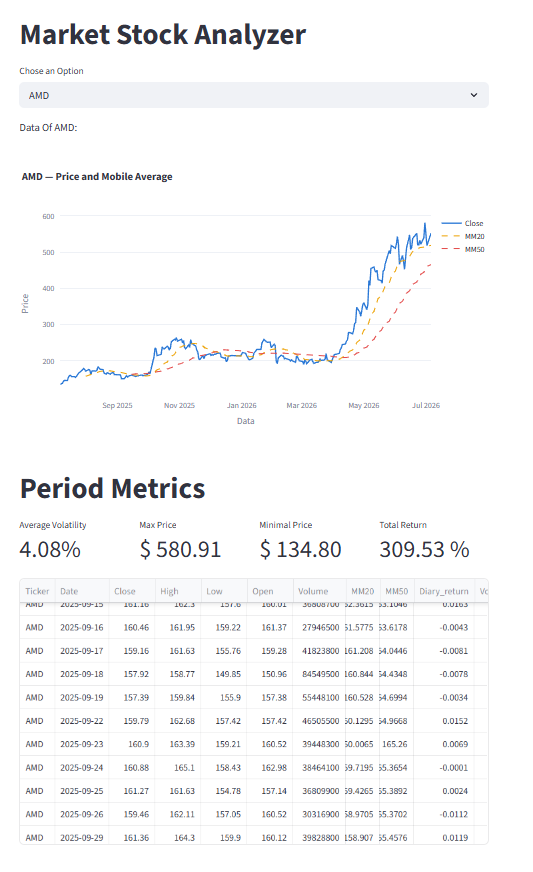
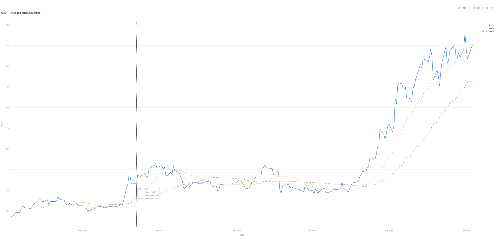
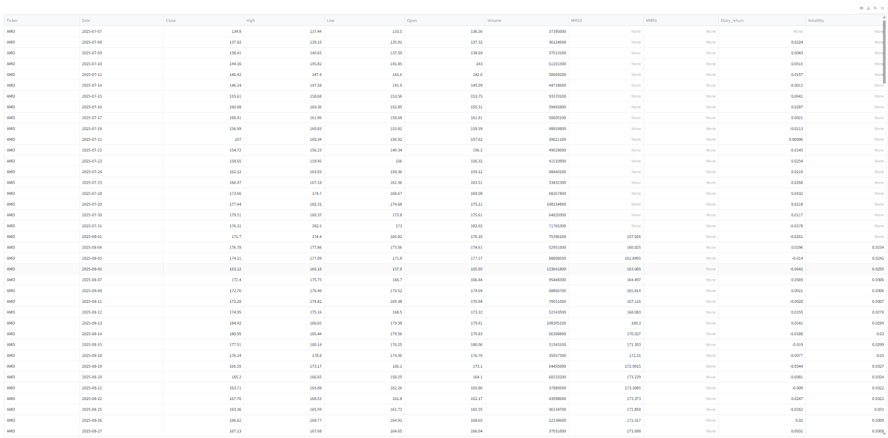
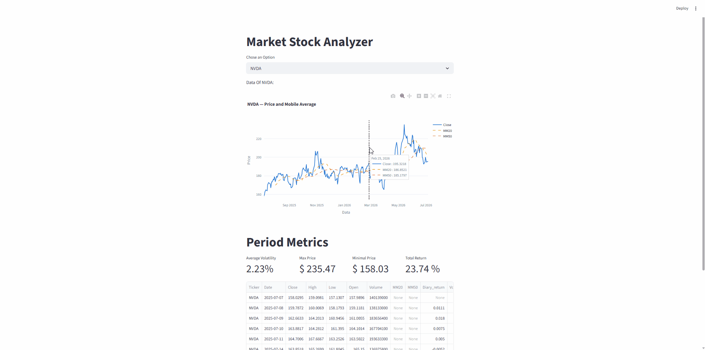

# 📈 Market Stock Analyzer

A Python-based ETL pipeline and interactive financial dashboard for analyzing B3 (Brazilian) and global semiconductor stocks over a 1-year period.

## Requirements to Run the Project

Make sure you have **Python 3.10+** installed on your system.

```bash
git clone https://github.com/davi-almeida-77/Stock-analyzer-python.git
cd Stock-analyzer-python
python -m venv venv
source venv/bin/activate  # On Windows: venv\Scripts\activate
pip install -r requirements.txt
```

To run the full ETL pipeline (extract, transform, export to Excel):

```bash
cd src
python main.py
```

To launch the interactive dashboard:

```bash
streamlit run src/dashboard/app.py
```

---

## About the Project

This project was developed as part of my learning journey to build a complete data engineering pipeline with Python. The goal was to gain hands-on experience with real financial data, covering the full ETL cycle — from raw extraction to an interactive visual dashboard.

The project analyzes **9 tickers** across two universes:

**B3 (Brazilian Market)**
- `PETR4.SA` — Petrobras
- `VALE3.SA` — Vale
- `ITUB4.SA` — Itaú Unibanco
- `WEGE3.SA` — WEG
- `MGLU3.SA` — Magazine Luiza

**Global Semiconductors**
- `NVDA` — Nvidia
- `AMD` — AMD
- `TSM` — TSMC
- `ASML` — ASML

**Benchmarks**
- `^BVSP` — Ibovespa
- `^SOX` — Philadelphia Semiconductor Index

The project focuses on building a structured ETL flow: extracting raw OHLCV data from the `yfinance` API, computing technical indicators in Pandas, exporting organized Excel reports, and visualizing everything in a Streamlit dashboard with interactive Plotly charts.

One of the main outcomes of this project was understanding how to structure a real data pipeline using OOP in Python, work with MultiIndex DataFrames, and connect a processing pipeline to a visual frontend.

---

## Tools Used in This Project

**DATA & ETL**
- `yfinance` — Market data extraction from Yahoo Finance API
- `pandas` — Data transformation, technical indicators, groupby, resample
- `openpyxl` — Excel export with multiple sheets

**DASHBOARD**
- `Streamlit` — Interactive web dashboard
- `Plotly` — Interactive financial charts with hover and zoom

**OTHER**
- `pathlib` — Cross-platform file path management
- `Git` — Version control

---

## Project Structure

```
stock-analyzer-python/
├── src/
│   ├── extractors/
│   │   └── extractor_yfinance.py   # E — Extract
│   ├── transformers/
│   │   └── stock_transformer.py    # T — Transform
│   ├── exporters/
│   │   └── excel_exporter.py       # L — Load
│   ├── dashboard/
│   │   └── app.py                  # Streamlit dashboard
│   └── main.py                     # ETL orchestrator
├── data/
│   ├── raw/                        # Raw CSVs per ticker
│   ├── processed/                  # Processed Excel with indicators
│   └── working/                    # Final Excel report (3 sheets)
└── requirements.txt
```

---

## Technical Indicators Computed

| Indicator | Description |
|---|---|
| MM20 | 20-day moving average of Close price |
| MM50 | 50-day moving average of Close price |
| Daily Return | Percentage change in Close price day over day |
| Volatility | 20-day rolling standard deviation of daily returns |

---

## Excel Report — 3 Sheets

- **History** — Full OHLCV + indicators for all tickers
- **Month Return** — Monthly percentage return per ticker
- **Resume** — Consolidated metrics: First, Last, Min, Max price, Volatility, Rise %, Lower %, Total Return %

---

## Dashboard in Action

### Interactive chart with Close price, MM20 and MM50



### Fullscreen chart with hover tooltip



### Raw data table



### Live demo


